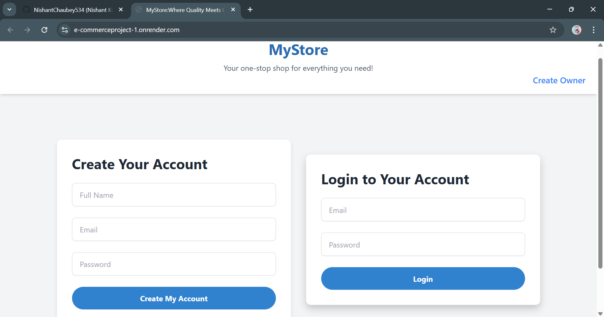
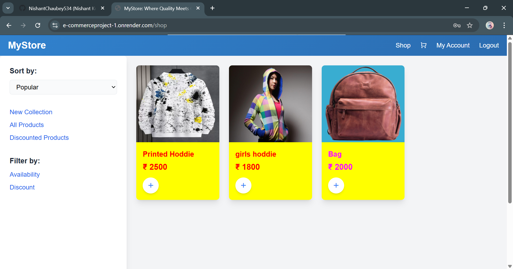
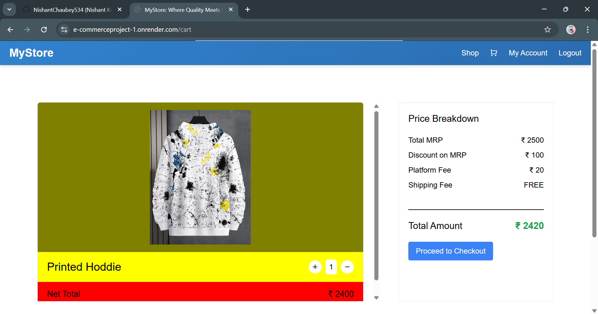
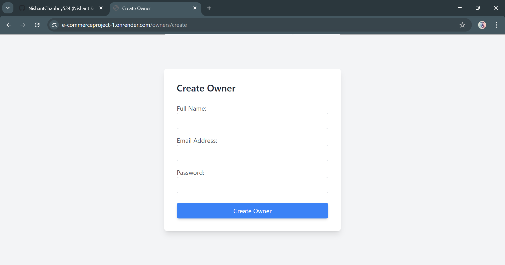
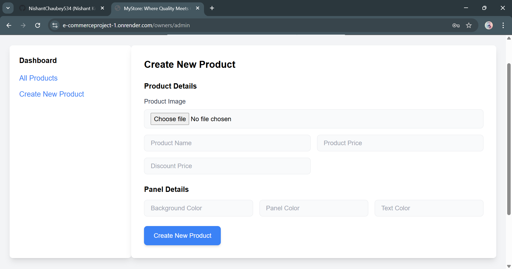

# Express.js E-commerce Web Application

## Overview
This project is a full-fledged **E-commerce Web Application** built using **Node.js**, **Express.js**, **MongoDB**, and **EJS**. It includes user authentication, product management, owner management, shopping cart functionality, and session-based user interactions.

## Features
- **User Authentication:** Register, login, logout, and session management with JWT authentication.
- **Product Management:** Add, update, delete, and display products.
- **Owner Management:** Admin panel for managing products and users.
- **Shopping Cart & Orders:** Users can add products to their cart, manage orders, and checkout.
- **File Uploads:** Images can be uploaded via `multer` middleware.
- **Flash Messages:** User-friendly notifications via `connect-flash`.
- **Secure Sessions:** Cookies and JWT-based authentication.

## Technologies Used
- **Backend:** Node.js, Express.js
- **Database:** MongoDB (via Mongoose)
- **Templating Engine:** EJS
- **Middleware:** Express-session, Connect-flash, Cookie-parser, Multer
- **Security:** JWT Authentication & bcrypt for password hashing

## Installation

### Prerequisites
Ensure you have the following installed:
- Node.js (>= 14.x.x)
- MongoDB

### Steps
1. Clone the repository:
   ```sh
   git clone [<repository_url>](https://github.com/NishantChaubey534/E-commerceproject)
   cd E-commerceproject
   ```

2. Install dependencies:
   ```sh
   npm install
   ```

3. Set up environment variables:
   - Create a `.env` file in the root directory.
   - Add the following environment variables:
     ```env
     JWT_KEY=your_secret_key
     MONGO_URI=your_mongodb_connection_string
     ```

4. Start the server:
   ```sh
   npm start
   ```
   The application will run on `http://localhost:3000`.

## Project Structure
```
project-folder/
│── public/            # Static files (CSS, JS, images)
│── route/             # Route handlers
│   ├── index.js       # Home and base routes
│   ├── ownersRouter.js # Owner management routes
│   ├── productsRouter.js # Product management routes
│   ├── usersRouter.js # User authentication routes
│── models/            # Mongoose models
│   ├── owner-model.js # Owner schema
│   ├── product-model.js # Product schema
│   ├── user-model.js # User schema
│── config/            # Configuration files
│   ├── mongoose-connection.js # Database connection
│── middleware/        # Custom middlewares
│   ├── isLoggedIn.js # JWT authentication middleware
│── controllers/       # Business logic
│   ├── authControllers.js # User authentication logic
│── utils/             # Utility functions
│   ├── multer-config.js # Multer file upload configuration
│── views/             # EJS templates
│── app.js             # Main application file
│── package.json       # Project dependencies and scripts
│── .env               # Environment variables (not committed)
```

## API Routes

### **User Routes**
- `POST /users/register` - Register a new user
- `POST /users/login` - User login
- `POST /users/logout` - User logout
- `GET /users/cart` - View user's cart
- `POST /users/cart/add` - Add a product to the cart

### **Owner Routes**
- `GET /owners/create` - Render owner registration page
- `POST /owners/create` - Register a new owner
- `GET /owners/admin` - Admin panel for owners

### **Product Routes**
- `POST /products/create` - Create a new product (file upload supported)
- `GET /products/all` - Fetch all products
- `GET /products/:id` - Fetch product details

## Authentication & Middleware
- **JWT Authentication:** User sessions are handled via JSON Web Tokens (JWT).
- **isLoggedIn.js:** Middleware to check if a user is logged in before accessing protected routes.
- **multer-config.js:** Middleware for handling file uploads (product images, user profile pictures, etc.).

## Screenshots
Here are some previews of the project:

### Login & SignUp Page


### Home Page


### Cart Page


### Owner SignUp Page


### Owner can create product on this Page



## Future Improvements
- Implement Stripe or PayPal payment gateway for checkout.
- Add role-based access control for admin and users.
- Improve UI using frontend frameworks like React or Vue.js.
- Implement RESTful API endpoints for a headless backend.

## License
This project is licensed under the MIT License.

## 📬Contact

GitHub: NishantChaubey534

Email: chaubeynishant2@gmail.com

📢 Star this repo if you found it helpful! ⭐
